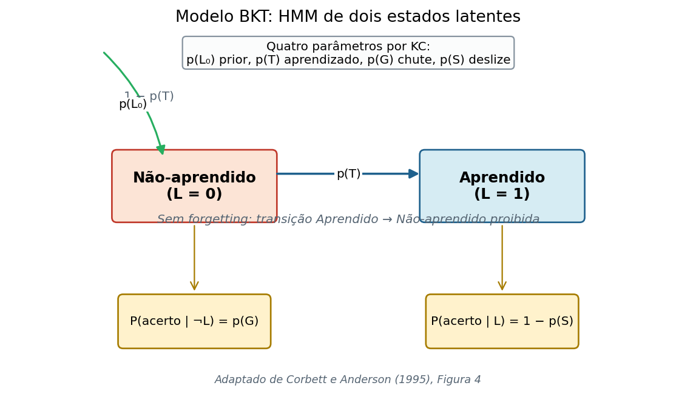
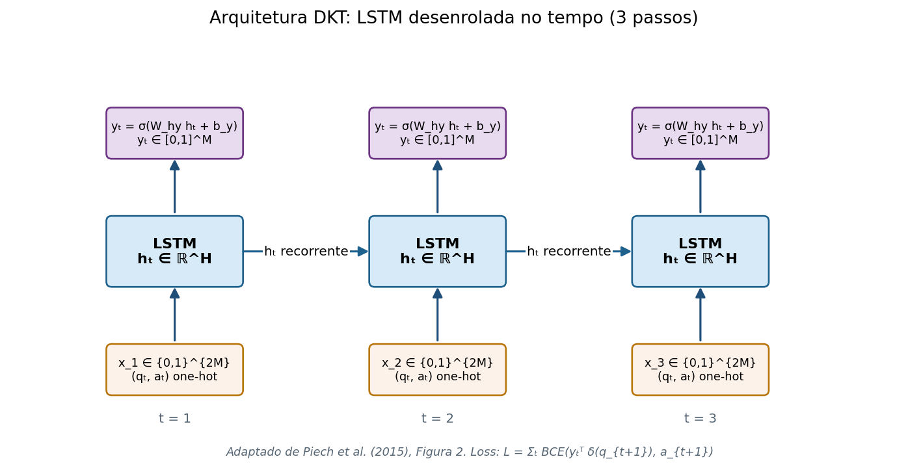
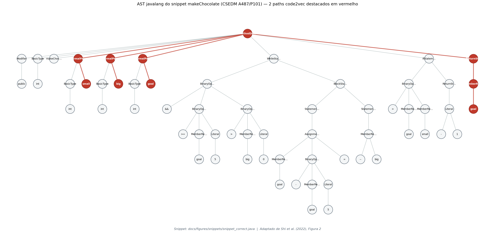
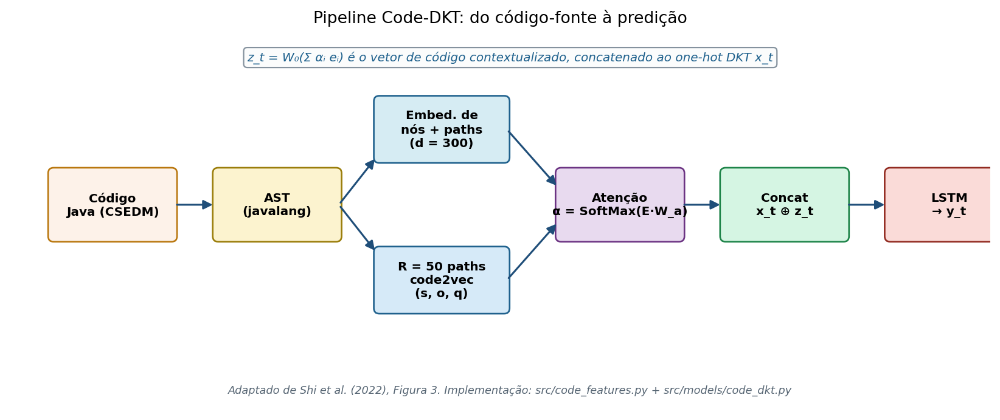
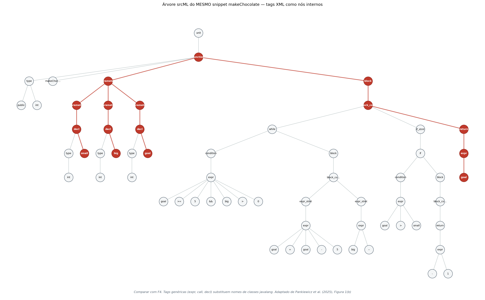
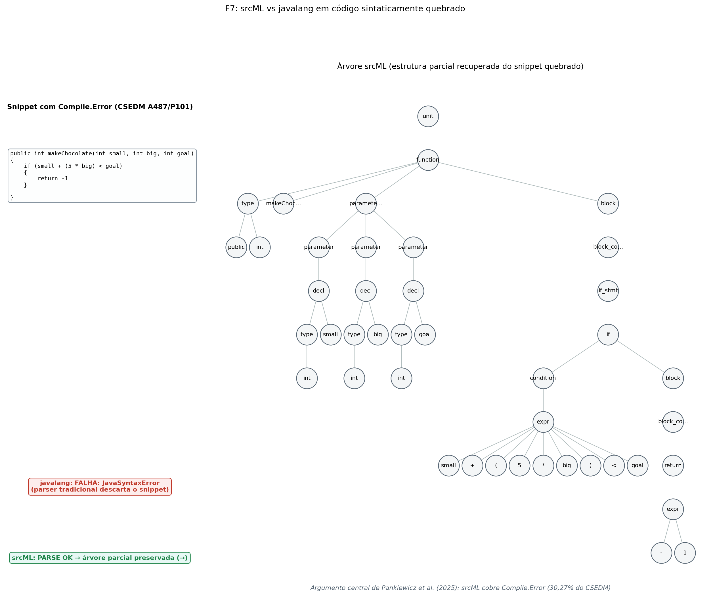
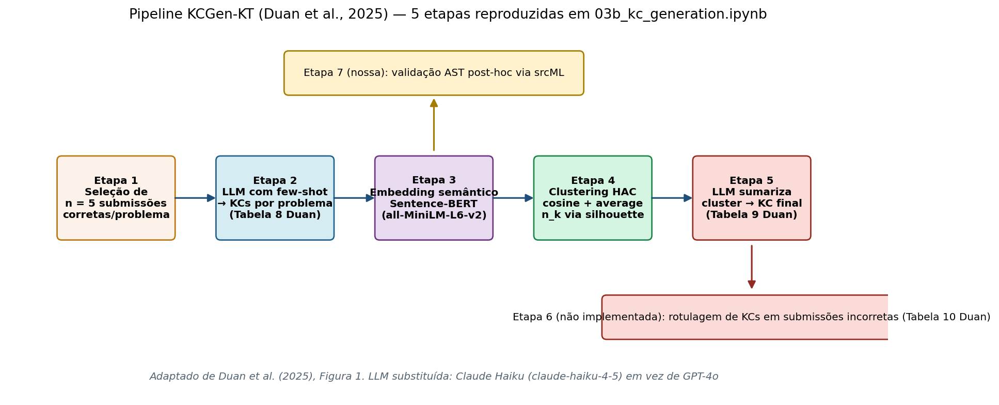

# Metodologia, Ferramentas e Técnicas

> Documento canônico de referência para o capítulo de Metodologia do TCC 1. Reúne, com rigor científico, as ferramentas, técnicas, fórmulas, diagramas e citações que sustentam cada decisão de implementação do experimento de Knowledge Tracing aplicado ao dataset CSEDM. As referências seguem a NBR 6023 (ABNT).

## Sumário

- [1. Introdução](#1-introdução)
- [2. Stack comum e protocolo experimental](#2-stack-comum-e-protocolo-experimental)
- [3. Glossário de símbolos](#3-glossário-de-símbolos)
- [4. Bloco A: Bayesian Knowledge Tracing (BKT)](#4-bloco-a-bayesian-knowledge-tracing-bkt)
- [5. Bloco B: Deep Knowledge Tracing (DKT)](#5-bloco-b-deep-knowledge-tracing-dkt)
- [6. Bloco C: Code-DKT](#6-bloco-c-code-dkt)
- [7. Bloco D: srcML-DKT](#7-bloco-d-srcml-dkt)
- [8. Bloco E: KCGen-KT, geração automática de Knowledge Components](#8-bloco-e-kcgen-kt-geração-automática-de-knowledge-components)
- [9. Síntese comparativa dos modelos](#9-síntese-comparativa-dos-modelos)
- [10. Referências bibliográficas](#10-referências-bibliográficas)
- [Apêndice A: Prompts do KCGen-KT (Duan et al., 2025) versus os nossos](#apêndice-a-prompts-do-kcgen-kt-duan-et-al-2025-versus-os-nossos)

---

## 1. Introdução

Este documento descreve as ferramentas, técnicas e decisões de implementação que sustentam o experimento de comparação de modelos de Knowledge Tracing (KT) do TCC 1. O experimento aplica o ciclo de quatro fases de Educational Data Mining proposto por Romero e Ventura (2010), com ênfase nas fases de *Data Preparation* e *Modelling & Evaluation*, sobre o dataset CSEDM (Spring 2019), no formato ProgSnap2 (PRICE et al., 2020).

Quatro modelos de KT são treinados e avaliados, em ordem crescente de sofisticação:

1. **BKT** (CORBETT; ANDERSON, 1995): linha de base probabilística baseada em Modelo Oculto de Markov (HMM) de dois estados.
2. **DKT** (PIECH et al., 2015): rede neural recorrente (LSTM) que aprende uma representação latente do conhecimento do estudante.
3. **Code-DKT** (SHI et al., 2022): estende DKT com vetor de código extraído de paths AST via atenção, no estilo do code2vec (ALON et al., 2019).
4. **srcML-DKT** (PANKIEWICZ; SHI; BAKER, 2025): mesma arquitetura do Code-DKT, mas com extrator de paths robusto a código não compilável.

Em paralelo, um pipeline auxiliar de extração automática de Knowledge Components (KCs), o KCGen-KT (DUAN et al., 2025), é reproduzido sobre os problemas do CSEDM. O downstream de KT que usaria esses KCs (Etapa 6 do paper original) fica fora do escopo deste TCC 1.

A leitura recomendada do documento é sequencial. O leitor que já conheça os papers seminais pode consultar o glossário (Seção 3) e ir direto ao bloco do modelo de interesse, cada um com a mesma estrutura interna: fundamentos teóricos, formulação matemática, arquitetura, implementação concreta no nosso código, e por fim uma subseção `Decisões e divergências` que explicita o que foi adaptado em relação ao paper original e por quê.

## 2. Stack comum e protocolo experimental

### 2.1 Dataset CSEDM

O CSEDM (*Computer Science Education Data Mining* Spring 2019) é distribuído no formato ProgSnap2 versão 6 (PRICE et al., 2020). Contém, na partição que usamos para modelagem (`data/CSEDM/MainTable.csv`), 413 estudantes brutos de um curso introdutório de Java (CS 1), distribuídos em cinco assignments numerados A439, A487, A492, A494 e A502, com 9 ou 10 problemas cada. Cada submissão é representada por um evento `Run.Program` com um escore de testes em `[0, 1]`, e cada compilação malsucedida pelo evento `Compile.Error`. O dataset não usa o evento `Submit` da especificação ProgSnap2; submissões valem aquilo que `Run.Program` registra.

A tabela de estados de código (`data/CSEDM/CodeStates/CodeStates.csv`) mapeia cada `CodeStateID` para o snapshot textual do código Java naquele instante, com cobertura de 100% no dataset.

### 2.2 Filtro de elegibilidade e split

Replicamos o filtro de elegibilidade descrito por Shi et al. (2022, p. 4): mantemos apenas estudantes com pelo menos 3 eventos `Run.Program` globais (`min_attempts >= 3`), restando 410 alunos. Sobre esses 410, fazemos um split 80/20 reproduzível com `sklearn.model_selection.train_test_split(test_size=0.2, random_state=1)`, obtendo 328 estudantes para treino e 82 para teste. Esse split é único e compartilhado por todos os modelos.

A escolha de `random_state=1` reproduz a constante usada nos scripts de referência do Code-DKT (`run.py:31`), garantindo que nossas partições recaiam sobre os mesmos estudantes que o paper. A implementação reside em `src/data_loader.py:243-284` (`load_spring2019_split`).

### 2.3 Definição de Knowledge Component

Adotamos a convenção de Shi et al. (2022, p. 1, footnote 1): cada `ProblemID` é tratado como uma KC distinta. Assim, treinamos um modelo independente por assignment, com `M` problemas (tipicamente `M = 10`). Essa decisão não decorre da definição teórica de KC em Corbett e Anderson (1995), em que cada KC corresponderia a uma regra de produção específica, mas é uma convenção operacional para alinhar a comparação com a literatura recente de programação introdutória.

### 2.4 Sequências e truncagem

Cada estudante produz, em cada assignment, uma sequência ordenada por `ServerTimestamp` de eventos. Para BKT e DKT, a sequência contém apenas `Run.Program`. Para Code-DKT e srcML-DKT, eventos `Compile.Error` são incluídos com `correct = 0` (decisão metodológica detalhada no Bloco D). A função `src/data_loader.py:108-165` (`build_sequences`) faz essa montagem.

Sequências mais longas que 50 eventos são truncadas para os últimos 50 (`src/data_loader.py:168-209`, `truncate_sequences`), respeitando a configuração de Shi et al. (2022, Tabela 3, p. 6).

### 2.5 Reprodutibilidade

Todas as execuções fixam `SEED = 42` no Python, NumPy e PyTorch. Para os modelos neurais (DKT, Code-DKT, srcML-DKT) também executamos um *multirun* com 10 sementes (42 a 51), o que permite reportar média e desvio padrão sobre execuções independentes. O BKT, sendo determinístico para os parâmetros do `pyBKT`, é executado uma única vez.

### 2.6 Métricas de avaliação

A métrica primária é a AUC-ROC calculada apenas sobre primeiras tentativas (*first-attempt AUC*), seguindo Shi et al. (2022, p. 5). A métrica secundária é a AUC-ROC sobre todas as tentativas (*all-attempts AUC*), seguindo Piech et al. (2015). Ambas são computadas em modo *pooled*, ou seja, concatenando as predições de todos os estudantes do conjunto de teste em um único vetor antes de chamar `sklearn.metrics.roc_auc_score`. A implementação compartilhada está em `src/evaluation.py:38-61` (`compute_auc`).

Para comparar pares de modelos, aplicamos o teste de postos sinalizados de Wilcoxon (`scipy.stats.wilcoxon`) sobre os pares `(assignment, seed)`, totalizando 50 pares para comparações entre modelos neurais. Os p-valores são corrigidos para múltiplas comparações com Holm-Bonferroni, conforme Holm (1979).

### 2.7 Bibliotecas compartilhadas

| Biblioteca | Versão | Função no pipeline | Referência |
|---|---|---|---|
| Python | 3.10 ou superior | Linguagem hospedeira | Van Rossum e Drake (2009) |
| Jupyter Notebook | atual | Ambiente de execução dos experimentos | Kluyver et al. (2016) |
| `pandas` | atual | Manipulação de dados tabulares | McKinney (2010) |
| `numpy` | 2.4 | Computação numérica em arrays | Harris et al. (2020) |
| `scikit-learn` | 1.8 | `roc_auc_score`, `train_test_split`, `AgglomerativeClustering`, `silhouette_score` | Pedregosa et al. (2011) |
| `scipy.stats` | atual | Teste de Wilcoxon | Virtanen et al. (2020) |
| `matplotlib` | 3.10 | Figuras (todas as do documento) | Hunter (2007) |
| `seaborn` | atual | Visualizações estatísticas (notebook de comparação) | Waskom (2021) |

## 3. Glossário de símbolos

Para evitar repetição entre blocos, esta tabela única consolida toda a notação. Cada bloco posterior introduz apenas símbolos novos.

| Símbolo | Significado | Bloco de origem |
|---|---|---|
| `t` | Índice temporal da tentativa do estudante | Comum |
| `q_t` | Identificador do problema (KC) na tentativa `t` | Comum |
| `a_t` | Resultado binário da tentativa `t` (1 = acerto, 0 = erro) | Comum |
| `M` | Número de problemas distintos no assignment | Comum |
| `δ(·)` | Vetor one-hot que indica o problema seguinte | DKT |
| `p(L_t)` | Probabilidade do estudante dominar a KC no instante `t` | BKT |
| `p(L_0)` | Prior de domínio antes da primeira tentativa | BKT |
| `p(T)` | Probabilidade de transição de não-aprendido para aprendido | BKT |
| `p(G)` | Probabilidade de acerto por chute (guess) | BKT |
| `p(S)` | Probabilidade de erro por deslize (slip) | BKT |
| `x_t` | Vetor de entrada da rede no instante `t` | DKT e derivados |
| `h_t` | Estado oculto recorrente da LSTM no instante `t` | DKT e derivados |
| `y_t` | Vetor de probabilidades de acerto, uma entrada por problema | DKT e derivados |
| `W_xh`, `W_hh`, `W_hy` | Matrizes de pesos da RNN | DKT |
| `b_h`, `b_y` | Vieses da RNN | DKT |
| `H` | Dimensão do estado oculto da LSTM | DKT |
| `R` | Número de paths AST extraídos por submissão (truncado) | Code-DKT e srcML-DKT |
| `p_r = (s_r, o_r, q_r)` | Triplo (folha inicial, sequência de operações, folha final) que define um path code2vec | Code-DKT |
| `e_r` | Embedding do `r`-ésimo path | Code-DKT |
| `E` | Matriz de embeddings de paths, dimensão `R × d` | Code-DKT |
| `W_a`, `W_0` | Matrizes de pesos da atenção sobre paths | Code-DKT |
| `α` | Vetor de pesos da atenção, `α ∈ [0, 1]^R`, soma 1 | Code-DKT |
| `z_t` | Vetor de código contextualizado no instante `t` | Code-DKT |
| `d` | Dimensão dos embeddings concatenados de paths (no nosso caso, 300) | Code-DKT |
| `λ` | Hiperparâmetro de balanceamento entre perdas (multi-task) | KCGen-KT |
| `L_CorrectPred` | Perda de predição de correctness | KCGen-KT |
| `L_CodePred` | Perda de predição de código do próximo passo | KCGen-KT |
| `L_KC` | Perda de fidelidade aos KCs gerados | KCGen-KT |

## 4. Bloco A: Bayesian Knowledge Tracing (BKT)

### 4.1 Fundamentos teóricos

O BKT foi proposto por Corbett e Anderson (1995) no contexto do APT Lisp Tutor, um tutor inteligente que ensinava programação em Lisp. O modelo descreve o conhecimento do estudante sobre cada KC (no paper original, cada regra de produção do tutor) como uma variável binária latente `L`: `L = 0` significa que o estudante ainda não dominou a KC, e `L = 1` significa que domina. A cada tentativa, observa-se apenas o resultado binário (acerto ou erro), e o BKT atualiza a estimativa de `L` por inferência bayesiana.

O modelo é, formalmente, um Modelo Oculto de Markov (HMM) de dois estados com emissões binárias, e tem quatro parâmetros estimados por KC. Essa parametrização parcimoniosa explica em parte por que o BKT continua sendo a linha de base padrão em Knowledge Tracing três décadas depois.

### 4.2 Formulação matemática

A atualização do estado de conhecimento após observar uma tentativa segue duas equações. A primeira é a atualização bayesiana posterior, condicional ao resultado observado (CORBETT; ANDERSON, 1995, Seção 3, p. 257, eq. 1):

$$p(L_t) = p(L_{t-1} | \text{evidência}) + (1 - p(L_{t-1} | \text{evidência})) \cdot p(T)$$

A segunda fornece a probabilidade de acerto na próxima tentativa, marginalizando sobre o estado latente (CORBETT; ANDERSON, 1995, Seção 3, p. 257, eq. 2):

$$p(C_t = 1) = p(L_t) \cdot (1 - p(S)) + (1 - p(L_t)) \cdot p(G)$$

Os quatro parâmetros por KC têm interpretação direta:

- `p(L_0)`: prior, a probabilidade de o estudante já dominar a KC antes da primeira tentativa.
- `p(T)`: probabilidade de aprender a KC depois de uma tentativa que ainda não a dominava.
- `p(G)`: probabilidade de acertar por chute, dado que a KC não foi dominada.
- `p(S)`: probabilidade de errar por deslize, dado que a KC foi dominada.

O BKT clássico não modela esquecimento, ou seja, a transição de aprendido para não-aprendido tem probabilidade zero. Essa hipótese é apropriada para horizontes curtos de tutorado (sessões de minutos a horas), e foi mantida na nossa replicação.

### 4.3 Arquitetura visual

A Figura 1 esquematiza o HMM de dois estados, com a transição `p(T)` para o estado aprendido, o auto-laço com probabilidade `1 - p(T)` no estado não-aprendido, e as emissões observáveis controladas por `p(G)` e `p(S)`.



*Figura 1: Modelo BKT como HMM de dois estados latentes, adaptado de Corbett e Anderson (1995, Figura 4).*

### 4.4 Implementação concreta

A implementação está em `src/models/bkt.py` e se apoia na biblioteca `pyBKT` (BADRINATH; WANG; PARDOS, 2021), que estima os quatro parâmetros por KC via algoritmo Expectation-Maximization (EM). O fluxo é o seguinte:

1. **Conversão para formato `pyBKT`** (`sequences_to_pyBKT_df`, linha 12): as sequências internas são serializadas em um DataFrame longo com colunas `[user_id, skill_name, correct, is_first_attempt]`, em que `skill_name = ProblemID`.
2. **Treino** (`train_bkt`, linha 39): chamada `Model(seed=42).fit(...)` ajusta um modelo por assignment (todas as KCs do assignment compartilham o treino, mas cada KC tem seus próprios quatro parâmetros).
3. **Predição** (`predict_bkt`, linha 55): para cada par (estudante, tentativa) do conjunto de teste, o BKT retorna `p(C_t = 1)` na coluna `correct_predictions`.
4. **Avaliação** (`compute_auc`, linha 74): mesma função pooled descrita na Seção 2.6, com filtro opcional por `is_first_attempt`.

### 4.5 Decisões e divergências

**Patches necessários no `pyBKT` 1.4.1.** Para que o `pyBKT` rodasse na nossa stack moderna (NumPy 2.4, scikit-learn 1.8) foram necessários três ajustes localizados no código instalado dentro do `.venv`. O primeiro substitui o uso de `np.float`, removido em NumPy 1.20, pelo tipo `float` nativo do Python. O segundo trata uma mudança na API do scikit-learn 1.8 na qual o argumento `n_splits` da função de cross-validation interna passou a exigir explicitação. O terceiro é o mais relevante e merece destaque: o E-step do EM no `pyBKT` foi originalmente paralelizado com `multiprocessing`, e em algumas versões do Python o pool de workers só funciona quando o script chamador roda dentro de um bloco `if __name__ == "__main__":`. Isso quebra dentro de notebooks Jupyter, que executam o código no escopo `<module>`. Foi adicionado um fallback sequencial para o E-step quando a paralelização falha, garantindo que o ajuste do modelo termine sem travar.

**Seed `42` em vez de `0`.** O repositório de Shi et al. (2022) usa `setup_seed(0)` (`run.py:31`); padronizamos `SEED = 42` em todo o nosso pipeline para alinhar BKT, DKT, Code-DKT e srcML-DKT, e para combinar com convenções comuns de reprodutibilidade na comunidade Python.

**Binarização por `Score == 1.0`.** O CSEDM contém escores parciais em cerca de 37% dos `Run.Program`. Para alimentar o BKT, que opera sobre observações binárias, adotamos o critério estrito `correct = (Score == 1.0)`, herdado da metodologia de Shi et al. (2022). Esse limiar é mais conservador que a binarização por `Score >= 0.5` e produz uma taxa global de acerto de 23,68% que reproduz o valor reportado no paper, importante para que a comparação seja justa.

## 5. Bloco B: Deep Knowledge Tracing (DKT)

### 5.1 Fundamentos teóricos

O DKT, proposto por Piech et al. (2015) na NeurIPS 28, substitui a parametrização explícita por KC do BKT por uma representação latente densa aprendida por uma rede neural recorrente. Ao invés de manter quatro parâmetros por KC, a LSTM mantém um estado oculto `h_t` de dimensão `H` que evolui à medida que o estudante interage com o sistema. A saída em cada passo é um vetor `y_t` com `M` entradas, uma por problema, contendo a probabilidade prevista de o estudante acertar cada problema na próxima tentativa.

A grande mudança conceitual em relação ao BKT é o tratamento implícito da estrutura de KCs: o DKT não recebe nenhuma anotação prévia de quais conceitos são exercitados em cada problema. As correlações entre problemas (e portanto entre KCs) emergem da dinâmica da LSTM treinada por gradiente.

### 5.2 Formulação matemática

A célula recorrente computa o estado oculto pela equação clássica de RNN (PIECH et al., 2015, Seção 3, p. 3):

$$h_t = \tanh(W_{xh} x_t + W_{hh} h_{t-1} + b_h)$$

A saída sigmoidal por problema é dada por:

$$y_t = \sigma(W_{hy} h_t + b_y)$$

A função objetivo é uma soma de entropias cruzadas binárias, restritas à entrada de `y_t` correspondente ao problema efetivamente respondido no passo seguinte (PIECH et al., 2015, Seção 3.3, p. 4, eq. 3):

$$\mathcal{L} = \sum_t \ell(y_t^\top \delta(q_{t+1}), a_{t+1})$$

onde `δ(q_{t+1})` é o vetor one-hot do problema `t+1`, `a_{t+1}` é a resposta binária no passo seguinte e `ℓ(·, ·)` é binary cross-entropy. O paper usa de fato uma LSTM no lugar da RNN simples; as equações detalhadas da LSTM estão no Apêndice A do paper original (PIECH et al., 2015).

### 5.3 Codificação de entrada

A entrada `x_t` é um vetor one-hot de dimensão `2M` que codifica conjuntamente o problema respondido `q_t` e o resultado `a_t`. A convenção, fielmente seguida na nossa implementação, é:

- se `a_t = 1`, a posição `q_t` é ligada (`x_t[q_t] = 1`);
- se `a_t = 0`, a posição `q_t + M` é ligada (`x_t[q_t + M] = 1`).

Assim, problemas distintos e resultados distintos têm representações disjuntas, e a LSTM aprende a discriminar acertos de erros sem precisar de uma camada auxiliar.

### 5.4 Arquitetura visual

A Figura 3 desenrola a LSTM ao longo de três passos consecutivos, evidenciando as entradas one-hot, a recorrência do estado oculto e as saídas sigmoidais por problema.



*Figura 3: Arquitetura DKT desenrolada no tempo (três passos), adaptada de Piech et al. (2015, Figura 2).*

### 5.5 Implementação concreta

A implementação está em `src/models/dkt.py`, classe `DKTModel` (linha 22). Usa PyTorch (PASZKE et al., 2019), em particular `torch.nn.LSTM` com `num_layers=1`, e empilha sobre ela uma camada linear seguida de sigmoide. Os hiperparâmetros, todos no código, são:

| Hiperparâmetro | Valor | Localização |
|---|---|---|
| `hidden_dim` | 200 | `dkt.py`, classe `DKTModel` |
| `dropout` na saída | 0,2 | `dkt.py`, classe `DKTModel` |
| `lr` (Adam) | 0,0005 | `dkt.py`, linhas 204 e 220 |
| `batch_size` | 128 | `dkt.py`, linha 205 |
| `epochs` | 40 | `dkt.py`, linha 206 |
| `max_len` | 50 | `dkt.py`, linha 207 |
| Gradient clipping | `max_norm = 10.0` | `dkt.py`, linha 254 |

A montagem do tensor de entrada (`build_input_tensor`, linhas 73 a 135) usa *left-zero-padding*, padrão no `readdata.py` do repositório oficial do Code-DKT. A função de perda (`dkt_loss`, linhas 138 a 176) aplica `F.binary_cross_entropy` em modo elemento a elemento, mascarado por uma matriz booleana que indica posições válidas (descartando o padding e o último passo de cada sequência, para o qual não há rótulo de alvo).

### 5.6 Decisões e divergências

**O primeiro evento não é predito.** Cada estudante começa sem histórico, então a primeira tentativa não tem como ser prevista pela LSTM. A função `predict_dkt` (linhas 310 e 311) explicitamente descarta esse primeiro evento da avaliação. Essa decisão é consistente com o protocolo de probing usado no Code-DKT.

**`hidden_dim = 200` adotado por busca grossa.** O notebook `05_dkt.ipynb` faz uma seleção curta entre `{128, 200}` em hidden_dim e `{0.0, 0.2}` em dropout, treinando por 10 épocas cada combinação e escolhendo a melhor por AUC no conjunto de validação. A escolha caiu em `(200, 0,2)`, próxima do `hidden_dim = 200` do paper original de Piech et al. (2015), embora o paper use *mini-batches* de tamanho 100 com SGD e nós usemos 128 com Adam (lr = 0,0005).

**Multirun com 10 sementes.** Para estimar variância de execução, treinamos cada modelo 10 vezes com sementes 42 a 51. Essa multiplicação não está no paper original de Piech et al. (2015), e foi adicionada para que comparações estatísticas com Code-DKT e srcML-DKT (que sofrem variância semelhante) tenham N suficiente para o teste de Wilcoxon.

## 6. Bloco C: Code-DKT

### 6.1 Fundamentos teóricos

O Code-DKT, proposto por Shi et al. (2022) na EDM 2022, parte da observação de que o estado de aprendizado de um estudante de programação não está completamente capturado pelo par `(problema, acerto)`. Duas submissões erradas para o mesmo problema podem revelar erros conceituais distintos, e ignorar o conteúdo do código descarta esse sinal. O modelo estende o DKT acrescentando, a cada passo, um vetor de código `z_t` derivado do snapshot textual da submissão por meio de atenção sobre paths AST no estilo do code2vec (ALON et al., 2019).

A novidade está localizada antes da LSTM: a entrada da célula recorrente passa de `x_t` puro para a concatenação `concat(x_t, z_t)`, deixando o restante da arquitetura idêntico ao DKT. Toda a sofisticação está em como `z_t` é calculado.

### 6.2 Representação do código por paths code2vec

Cada submissão é parseada em uma AST (árvore sintática abstrata). De toda essa árvore, extraímos paths leaf-to-leaf, ou seja, caminhos entre duas folhas que passam por ancestrais comuns. Cada path é representado por uma tripla:

$$p_r = (s_r, o_r, q_r)$$

onde `s_r` e `q_r` são os tokens das folhas inicial e final (tipicamente identificadores, literais ou palavras-chave) e `o_r` é a sequência textual de nós internos atravessados, juntada por `@`. Por exemplo, um path possível no snippet `makeChocolate` é `(big, big@FormalParameter@MethodDeclaration@WhileStatement@BinaryOperation@..., goal)`.

Os paths são filtrados por comprimento máximo (`max_path_length = 8` nós) e largura máxima (diferença inteira entre `order` dos nós filhos da LCA, `max_path_width = 2`), seguindo `path_extractor.py` do repositório oficial do Code-DKT. Quando uma submissão produz mais que `R = 50` paths válidos, uma amostragem aleatória reprodutível (`random.Random(seed=42)`) reduz a `R`.

### 6.3 Mecanismo de atenção sobre paths

Cada path é projetado em um embedding `e_r` de dimensão `d = 300`, composto pela concatenação de três embeddings de 100 dimensões cada (embedding do token inicial, do token final e do path string). A matriz `E` empilha os `R` embeddings, e a atenção computa pesos normalizados (SHI et al., 2022, Seção 3.2, p. 5):

$$\alpha = \mathrm{SoftMax}(E \cdot W_a)$$

$$z_t = W_0 \left( \sum_{r=1}^{R} \alpha_r \, e_r \right)$$

A intuição é que diferentes paths capturam diferentes aspectos do código (uso de variáveis, estrutura de controle, chamadas de método), e a atenção aprende quais são informativos para o objetivo de prever o próximo acerto. O resultado `z_t` é depois concatenado com `x_t` antes de entrar na LSTM.

### 6.4 Arquitetura completa

A Figura 4 mostra a AST real do snippet `makeChocolate` parseada com javalang, com dois paths code2vec destacados em vermelho. O snippet é uma submissão correta real (CodeStateID `5f8819...`, AssignmentID 487, ProblemID 101, SubjectID `e3edca...`) e está salvo em `docs/figures/snippets/snippet_correct.java`.



*Figura 4: AST javalang do snippet `makeChocolate`, dois paths code2vec destacados em vermelho. Adaptada de Shi et al. (2022, Figura 2).*

A Figura 5 monta o pipeline completo, do código Java bruto até a saída `y_t`, passando por extração de AST, embeddings de paths, atenção e LSTM.



*Figura 5: Pipeline completo do Code-DKT, adaptado de Shi et al. (2022, Figura 3).*

### 6.5 Implementação concreta

A extração de paths está em `src/code_features.py:88-178`, função `extract_paths_javalang`. O fluxo é o seguinte:

1. **Parse Java** via `javalang.parser.Parser().parse_member_declaration()` (linhas 82 a 85). A biblioteca `javalang` é um parser puro Python para Java, equivalente em comportamento ao parser do paper original.
2. **Construção de árvore anytree** (`_build_tree`, linhas 74 a 79): cada nó da AST do javalang vira um `anytree.Node` com atributo `order` (string de posição hierárquica) e `token` (nome da classe AST ou conteúdo textual da folha).
3. **Enumeração de paths** via `anytree.Walker().walk()` para cada par de folhas (linhas 137 a 169). Os filtros de comprimento e largura, descritos acima, descartam paths longos demais ou demasiado distantes na árvore.
4. **Amostragem para `R = 50`** quando há mais paths do que o limite (linhas 174 a 176).

O cache de paths é precomputado para todos os `CodeStateID` únicos em uma única passada paralela (`build_cache`, linhas 192 a 220), usando `multiprocessing.Pool.imap_unordered` com `chunksize = 64`. Isso é importante porque o mesmo snapshot pode aparecer em várias sequências de estudantes.

O vocabulário de tokens e paths é construído apenas sobre o conjunto de treino (`build_vocab`, linhas 227 a 251), reservando o índice 0 para `PAD/UNK`. Paths e tokens vistos pela primeira vez no conjunto de teste mapeiam para esse índice especial.

O modelo neural está em `src/models/code_dkt.py`, classe `CodeDKTModel` (linha 29). Cada path é convertido em três índices inteiros (start, path_string, end) por `paths_to_tensor` (`code_features.py:258-284`); esses índices alimentam três `nn.Embedding` de 100 dimensões cada, que concatenadas formam `d = 300`. Em seguida há `Linear(d, d) + tanh`, atenção `Linear(d, 1) + Softmax`, soma ponderada e finalmente concatenação com `x_t` antes da LSTM. O `embed_dropout = 0.2` é aplicado apenas em treino.

A função de perda é reaproveitada de `src/models/dkt.py` (`dkt_loss`). Os hiperparâmetros de treino são iguais aos do DKT: `lr = 0,0005`, `batch_size = 128`, `epochs = 40`, gradient clipping `max_norm = 10.0`.

### 6.6 Decisões e divergências

**Atenção sobre paths, e não sobre tempo.** A camada de atenção na nossa implementação (`code_dkt.py`, linha 79) aplica `Softmax(dim=2)` sobre as `R` paths de cada submissão. O código de referência (`c2vRNNModel.py:21` do repositório oficial) aplica `Softmax(dim=1)`, ou seja, sobre a dimensão temporal. Examinamos as equações do paper (SHI et al., 2022, Seção 3.2) e concluímos que a atenção semanticamente pretendida pelos autores é sobre paths (cada `α_r` é o peso de um path), não sobre o tempo, o que justifica a nossa escolha. A diferença está documentada em comentário no próprio arquivo (linhas 79 e 80).

**`R = 50` configurável, em vez de `MAX_CODE_LEN = 100` fixo.** O código de referência usa uma constante global `MAX_CODE_LEN = 100`. Optamos por parametrizar como argumento de função (padrão 50) tanto para reduzir o custo de memória do cache de features quanto para permitir experimentos de ablação rápidos.

**Gradient clipping `max_norm = 10.0`.** Adicionamos o clipping (linha 228 de `code_dkt.py`, alinhado com `dkt.py`) como salvaguarda contra exploding gradients, problema clássico em RNNs (PASCANU; MIKOLOV; BENGIO, 2013) também citado por Piech et al. (2015). O código de referência do Code-DKT não documenta o uso de clipping.

**Vocabulário sequencial em vez de hashing.** O código de referência atribui índices via `random.getrandbits` (uma forma de hashing), aceitando colisões em troca de não precisar manter dicionários. Optamos pelo padrão `build_vocab` com índices sequenciais e índice 0 reservado para `PAD/UNK`, mais transparente e debugável.

**Limitação herdada do `javalang`.** O parser `javalang` exige código sintaticamente válido em Java e falha silenciosamente em `Compile.Error`. No CSEDM, 30,27% dos eventos são `Compile.Error`, portanto o Code-DKT na nossa configuração descarta esses eventos da sequência (eles são montados no `build_sequences` mas o cache de features retorna lista vazia para o `CodeStateID`, e o Code-DKT então não consegue alimentar `z_t` com nada útil). Essa limitação motiva o Bloco D, srcML-DKT.

## 7. Bloco D: srcML-DKT

### 7.1 Fundamentos teóricos e motivação

O srcML-DKT, proposto por Pankiewicz, Shi e Baker (2025) na EDM 2025 (short paper), parte de uma única observação prática: o parser `javalang` (e parsers similares para outras linguagens) exige código sintaticamente válido, mas grande parte das submissões de estudantes em ambientes de programação introdutória contém erros de sintaxe que tornam o código *parseavelmente* inviável. No nosso CSEDM, isso corresponde a 30,27% dos eventos. Descartar essas tentativas equivale a ignorar metade da sinalidade pedagógica do dataset: erros de sintaxe são tão informativos quanto resultados de execução, principalmente nas primeiras tentativas em que o estudante ainda está ajustando a estrutura do programa.

A solução de Pankiewicz, Shi e Baker (2025) é substituir `javalang` pelo srcML (COLLARD; DECKER; MALETIC, 2013), uma ferramenta de linha de comando que converte código em uma representação XML que preserva a estrutura mesmo quando o código não compila. A arquitetura do modelo permanece idêntica à do Code-DKT; muda apenas o pipeline de extração de features.

### 7.2 Pipeline de extração via srcML

O fluxo de extração é estruturalmente igual ao do Code-DKT, com a diferença de que a árvore é construída a partir do XML do srcML em vez da AST do `javalang`:

1. **Chamada CLI** (`src/srcml_features.py:118-124`): o snippet é passado pela entrada padrão de `srcml --language=Java`, com `timeout = 10s`. O processo é spawned via `subprocess.run`.
2. **Parsing XML** (linhas 131 a 134): a saída é lida com `xml.etree.ElementTree`, descartando o namespace `http://www.srcML.org/srcML/src` por meio da função `_strip_ns` (linhas 53 a 55).
3. **Construção da árvore anytree** (`_srcml_build_tree`, linhas 72 a 81): cada elemento XML vira um `anytree.Node`. Folhas (elementos sem filhos) carregam o texto literal (`elem.text.strip()`) ou, na falta dele, a tag local. Nós internos carregam apenas a tag local.
4. **Enumeração e filtragem de paths** (linhas 156 a 196): exatamente o mesmo `Walker` leaf-to-leaf usado no Code-DKT, com os mesmos limites `max_path_length = 8`, `max_path_width = 2`, `R = 50`.

O cache, o vocabulário (`build_vocab`), a tensorização (`paths_to_tensor`, `build_code_input_tensor`) e o modelo neural (`CodeDKTModel`) são todos reutilizados de `code_features.py` e `code_dkt.py` sem modificação. Isso garante que qualquer diferença empírica entre Code-DKT e srcML-DKT venha exclusivamente da troca do extrator de features.

### 7.3 Comparação visual javalang versus srcML

A Figura 6 mostra a árvore srcML do *mesmo* snippet `makeChocolate` da Figura 4, lado a lado para comparação direta. As diferenças saltam aos olhos: as tags srcML (`function`, `parameter_list`, `decl`, `while`, `expr`, `condition`, `block`) são bem mais genéricas que os nomes de classes do `javalang` (`MethodDeclaration`, `FormalParameter`, `WhileStatement`, `BinaryOperation`, `IfStatement`). Isso tem consequências discutidas na Seção 7.5.



*Figura 6: Árvore srcML do mesmo snippet `makeChocolate` da Figura 4. Adaptada de Pankiewicz, Shi e Baker (2025, Figura 1(b)).*

A Figura 7 evidencia o argumento central do srcML-DKT: para um snippet com `Compile.Error` real do CSEDM (mesmo problema, ponto-e-vírgula faltando em `return -1`), o `javalang` aborta com `JavaSyntaxError` enquanto o srcML produz uma árvore parcial que ainda preserva a estrutura visível (declaração da função, parâmetros, bloco `if`, retorno).



*Figura 7: srcML vs javalang em código com Compile.Error real do CSEDM (snippet em `docs/figures/snippets/snippet_compile_error.java`). Adaptada de Pankiewicz, Shi e Baker (2025, Figura 1(b)).*

### 7.4 Decisões e divergências

**Achado divergente em relação ao paper original.** Pankiewicz, Shi e Baker (2025) reportam, no dataset RunCode (C#), que srcML-DKT supera Code-DKT em AUC (0,8355 vs 0,8190 em first-attempt AUC, Tabela 3 do paper). Na nossa replicação sobre o CSEDM (Java), srcML-DKT ficou *abaixo* do Code-DKT em todos os 5 assignments, com diferenças entre -2,9pp e -4,2pp em first-attempt AUC. O teste de Wilcoxon com correção Holm-Bonferroni confirma significância estatística (p ajustado < 0,001).

**Causa hipotetizada.** O vocabulário de paths srcML é cerca de 2,6 a 2,7 vezes menor que o vocabulário javalang no nosso dataset, e as tags XML (`expr`, `call`, `decl`) substituem identificadores mais discriminativos como `MethodInvocation` ou `IfStatement`. Isso reduz o poder discriminativo dos embeddings de paths. O benefício de cobertura adicional (incluir `Compile.Error` na sequência) não compensa, no CSEDM, a perda de granularidade.

**Não há contradição com o paper.** O paper de Pankiewicz, Shi e Baker (2025) reporta resultados no RunCode, não no CSEDM. As populações são distintas (estudantes europeus em C# vs estudantes da Virginia Tech em Java), os assignments são distintos e o perfil de erros também. O nosso achado é descritor de transferência (negative transfer) para o nosso domínio, não refutação do paper.

**Taxa de parsing do srcML.** Em smoke test no nosso `09_srcml_dkt.ipynb`, o srcML parseou 100% dos snippets testados (incluindo Compile.Error), confirmando a robustez prometida pelo paper. O javalang, em comparação, falha silenciosamente em todos os Compile.Error sintaticamente quebrados.

## 8. Bloco E: KCGen-KT, geração automática de Knowledge Components

### 8.1 Fundamentos teóricos

O KCGen-KT, proposto por Duan et al. (2025) em pré-print no arXiv, ataca um gargalo histórico do Knowledge Tracing aplicado a programação: a obtenção de um Q-matrix (mapa problema → KCs) interpretável. As convenções existentes ou colapsam todos os KCs em `ProblemID` (perdendo granularidade), ou exigem rotulagem manual por especialista (cara e pouco escalável). Duan et al. propõem usar um Large Language Model (LLM) para inferir, a partir de submissões corretas, quais KCs estão sendo exercitadas em cada problema, e então agregar essas inferências por clustering semântico para obter um inventário global de KCs.

O pipeline original tem várias etapas, das quais reproduzimos as cinco primeiras (e adicionamos uma sexta de validação). O modelo downstream de Knowledge Tracing que consome os KCs gerados (Etapa 6 do paper, Figura 2 do paper) está fora do escopo deste TCC 1, e está marcado como trabalho futuro.

### 8.2 Pipeline de 5 etapas (mais validação post-hoc)

O notebook `notebooks/03b_kc_generation.ipynb` implementa o pipeline. A Figura 8 esquematiza as etapas e nossas extensões.



*Figura 8: Pipeline KCGen-KT em 5 etapas reproduzidas, adaptado de Duan et al. (2025, Figura 1). As caixas em amarelo (Etapa 7 de validação srcML) e em vermelho (Etapa 6 pendente) são extensões nossas.*

As cinco etapas são:

1. **Seleção de submissões corretas**: para cada problema, selecionamos as `n = 5` primeiras submissões com `Score = 1.0` distintas (corretness e diversidade textual mínima).
2. **Geração de KCs via LLM**: para cada problema, enviamos à LLM (Claude Haiku) um prompt com instrução de inferir KCs e dois exemplos few-shot. A LLM responde em JSON com `problem_description` e uma lista de KCs nomeados.
3. **Embedding semântico**: cada KC textual gerado é embedado com Sentence-BERT (modelo `all-MiniLM-L6-v2`), produzindo um vetor de 384 dimensões.
4. **Clustering hierárquico aglomerativo (HAC)**: os embeddings de todos os KCs (somados em todos os problemas) são agrupados via `AgglomerativeClustering` com métrica `cosine` e linkage `average`. O número final de clusters é selecionado pelo valor `n_clusters` que maximiza a métrica `silhouette_score` em uma grade de valores plausíveis.
5. **Sumarização dos clusters via LLM**: para cada cluster, enviamos à LLM os KCs membros e pedimos um rótulo final único de 3 a 8 palavras, com justificativa de uma frase.

A Etapa 7 (nossa) faz validação AST post-hoc usando srcML para verificar se as estruturas mencionadas nos rótulos de KCs realmente aparecem em pelo menos uma submissão correta do problema correspondente. É um sanity check, não uma métrica de eval.

### 8.3 Decisões fundadas em ablations do paper

As escolhas-chave do nosso pipeline replicam ablações reportadas em Duan et al. (2025):

- **`n = 5` submissões por problema**: Tabela 5, p. 8 do paper. Para `n = 1`, a AUC do downstream cai para 0,798; para `n = 5` atinge 0,812; valores maiores saturam.
- **Código bruto, não AST**: Tabela 4, p. 8. Enviar AST junto piora (0,800), e enviar apenas AST piora ainda mais (0,784). A LLM aproveita melhor o código fonte textual.
- **Few-shot obrigatório**: Tabela 4, p. 8. Sem exemplos few-shot, a AUC cai de 0,812 para 0,782. Os dois exemplos few-shot ficam codificados no prompt do nosso `src/kc_generation.py`.

### 8.4 Prompts

Reproduzimos os três prompts principais do paper. Os textos originais estão nas Tabelas 8, 9 e 10 (DUAN et al., 2025, pp. 11 a 13). A nossa versão difere apenas em quatro pontos pequenos (LLM-alvo, idioma das instruções fixado em inglês, ordem dos campos JSON e nomes de exemplos), e está reproduzida na íntegra no [Apêndice A](#apêndice-a-prompts-do-kcgen-kt-duan-et-al-2025-versus-os-nossos).

### 8.5 Implementação concreta

| Componente | Ferramenta | Localização |
|---|---|---|
| LLM | Claude Haiku (`claude-haiku-4-5-20251001`) via SDK `anthropic` | `src/kc_generation.py` |
| Embeddings | `sentence-transformers` modelo `all-MiniLM-L6-v2` | `src/kc_generation.py` |
| Clustering | `sklearn.cluster.AgglomerativeClustering(metric='cosine', linkage='average')` | `src/kc_generation.py` |
| Seleção de `n_clusters` | `sklearn.metrics.silhouette_score` em busca por grade | `notebooks/03b_kc_generation.ipynb` |
| Validação AST | `src/srcml_features.py` reaproveitado da Seção 7 | `notebooks/03b_kc_generation.ipynb` |

Para detalhes operacionais (custos, número de chamadas, formato de cache em disco) consulte `PLAN_KC_GENERATION.md` e `docs/kc_generation_resumo.md`, que são as fontes primárias deste pipeline.

### 8.6 Decisões e divergências

**Substituição da LLM.** Duan et al. (2025) usam GPT-4o (Etapa 2 e Etapa 5) e Llama 3 (downstream da Etapa 6). Nós usamos Claude Haiku (`claude-haiku-4-5-20251001`) tanto na geração quanto na sumarização, por razões de custo (Haiku é 10x mais barato que GPT-4o para esse volume de chamadas) e disponibilidade (acesso via SDK `anthropic` já configurado no projeto). Como o paper documenta que o pipeline é relativamente robusto à escolha de LLM em prompts curtos, assumimos a substituição com baixo risco; uma avaliação cruzada (Haiku vs GPT-4o no mesmo conjunto de problemas) fica como trabalho futuro.

**Etapa 6 não implementada.** A Etapa 6 do paper (Tabela 10, KC Correctness Labeling Prompt) rotularia, para cada submissão *incorreta*, quais KCs específicas o estudante falhou. Esse rótulo seria input para o modelo de Knowledge Tracing downstream. No TCC 1 paramos na Etapa 5 (KCs finais), porque o foco da comparação é entre BKT, DKT, Code-DKT e srcML-DKT, todos definindo KC como `ProblemID`. A integração de KCs gerados como input alternativo a esses modelos é trabalho de fronteira para o TCC 2.

**Downstream KT integrando KCs também não implementado.** Pela mesma razão acima, o modelo KCGen-KT downstream (Figura 2 do paper original) não foi treinado. As equações de perda multi-task `L_KCGen-KT = λ(L_CodePred + L_CorrectPred) + (1 - λ) L_KC` (DUAN et al., 2025, Seção 3.2.7, p. 4) ficam como referência para o TCC 2.

## 9. Síntese comparativa dos modelos

Esta seção consolida, em tabelas, as características metodológicas dos quatro modelos e os resultados quantitativos do experimento. Os números vêm de `results/comparison_summary.json`, gerado pelo notebook `notebooks/07_comparison.ipynb`.

### 9.1 Comparativo metodológico

| Aspecto | BKT | DKT | Code-DKT | srcML-DKT |
|---|---|---|---|---|
| Origem | Corbett e Anderson (1995) | Piech et al. (2015) | Shi et al. (2022) | Pankiewicz, Shi e Baker (2025) |
| Família | HMM 2 estados | RNN (LSTM) | RNN + atenção sobre paths | RNN + atenção sobre paths |
| Input | `(problem, correctness)` binário | one-hot `(q, a) ∈ {0,1}^{2M}` | DKT input + 50 paths AST javalang | DKT input + 50 paths srcML |
| Trata `Compile.Error` | não (filtrado fora) | não (filtrado fora) | inclui na sequência com `correct=0`, mas paths vazios | inclui com `correct=0` e árvore parcial |
| Definição de KC | `ProblemID` (por convenção) | `ProblemID` (implícito) | `ProblemID` | `ProblemID` |
| Biblioteca principal | `pyBKT` | `torch` | `torch` + `javalang` + `anytree` | `torch` + srcML CLI + `xml.etree.ElementTree` |
| Arquivo do projeto | `src/models/bkt.py` | `src/models/dkt.py` | `src/models/code_dkt.py` + `src/code_features.py` | `src/models/code_dkt.py` + `src/srcml_features.py` |

### 9.2 First-attempt AUC por assignment

Valores em percentuais, média e desvio padrão sobre 10 seeds (BKT é determinístico).

| Assignment | BKT | DKT | Code-DKT | srcML-DKT |
|---|---|---|---|---|
| A439 | 63,21 | 75,56 ± 3,40 | 73,27 ± 1,34 | 70,41 ± 1,01 |
| A487 | 68,40 | 76,70 ± 3,24 | 79,56 ± 0,76 | 76,56 ± 0,87 |
| A492 | 54,20 | 82,05 ± 1,66 | 86,12 ± 0,53 | 81,93 ± 0,71 |
| A494 | 57,81 | 80,17 ± 5,05 | 81,85 ± 0,98 | 78,30 ± 0,90 |
| A502 | 56,92 | 80,78 ± 4,01 | 84,98 ± 1,01 | 81,17 ± 0,99 |

### 9.3 All-attempts AUC por assignment

| Assignment | BKT | DKT | Code-DKT | srcML-DKT |
|---|---|---|---|---|
| A439 | 64,23 | 70,89 ± 2,15 | 70,35 ± 0,67 | 67,25 ± 0,44 |
| A487 | 69,07 | 72,77 ± 1,18 | 74,89 ± 0,61 | 71,80 ± 0,51 |
| A492 | 63,62 | 76,66 ± 0,84 | 79,08 ± 0,74 | 75,80 ± 0,87 |
| A494 | 59,66 | 72,57 ± 2,79 | 75,07 ± 0,97 | 70,04 ± 0,92 |
| A502 | 57,37 | 72,48 ± 1,88 | 76,24 ± 0,77 | 72,59 ± 0,63 |

### 9.4 AUC pooled cross-assignment

A AUC pooled concatena predições de todos os assignments antes do cálculo, oferecendo um número único de resumo. BKT não tem AUC pooled estimado porque cada assignment tem sua própria escala de dificuldade e o BKT determinístico não suporta multirun para variância significativa nessa agregação.

| Modelo | First-attempt | All-attempts |
|---|---|---|
| DKT | 79,80 | 73,62 |
| Code-DKT | 81,55 | 75,61 |
| srcML-DKT | 78,04 ± 0,41 | 72,19 ± 0,41 |

### 9.5 Teste de Wilcoxon entre pares de modelos

Diferenças em pontos percentuais e p-valores corrigidos por Holm-Bonferroni, sobre N = 50 pares (`assignment × seed`).

| Comparação | Métrica | Δ médio (pp) | p ajustado | Significativo |
|---|---|---|---|---|
| Code-DKT vs DKT | first-attempt | +2,10 | 0,002 | sim |
| Code-DKT vs DKT | all-attempts | +2,05 | < 10⁻⁵ | sim |
| srcML-DKT vs Code-DKT | first-attempt | -3,48 | < 10⁻⁵ | sim |
| srcML-DKT vs Code-DKT | all-attempts | -3,63 | < 10⁻⁵ | sim |
| srcML-DKT vs DKT | first-attempt | -1,38 | 0,012 | sim |
| srcML-DKT vs DKT | all-attempts | -1,58 | < 10⁻⁵ | sim |

### 9.6 Critério de fidelidade ao paper de referência

O critério principal de conclusão do TCC 1 (definido em `CLAUDE.md`) é que o Code-DKT em A439 (`A1` no paper) atinja first-attempt AUC próximo de 74% (±3pp em relação aos 75,74% reportados por Shi et al. (2022, Tabela 2, p. 6). Nossa execução obteve **73,27% ± 1,34**, dentro da tolerância de ±3pp. O critério está satisfeito.

## 10. Referências bibliográficas

ALON, U.; ZILBERSTEIN, M.; LEVY, O.; YAHAV, E. **code2vec: learning distributed representations of code**. *Proceedings of the ACM on Programming Languages*, v. 3, n. POPL, p. 1-29, 2019. DOI: 10.1145/3290353.

BADRINATH, A.; WANG, F.; PARDOS, Z. **pyBKT: an accessible Python library of Bayesian Knowledge Tracing models**. In: INTERNATIONAL CONFERENCE ON EDUCATIONAL DATA MINING, 14., 2021, Paris. *Proceedings* [...]. International Educational Data Mining Society, 2021. p. 468-474.

COLLARD, M. L.; DECKER, M. J.; MALETIC, J. I. **srcML: an infrastructure for the exploration, analysis, and manipulation of source code**. In: IEEE INTERNATIONAL CONFERENCE ON SOFTWARE MAINTENANCE, 29., 2013, Eindhoven. *Proceedings* [...]. IEEE, 2013. p. 516-519. DOI: 10.1109/ICSM.2013.85.

CORBETT, A. T.; ANDERSON, J. R. **Knowledge tracing: modeling the acquisition of procedural knowledge**. *User Modeling and User-Adapted Interaction*, v. 4, n. 4, p. 253-278, 1995. DOI: 10.1007/BF01099821.

DUAN, Z.; FERNANDEZ, N.; NARAYANAN, A. B. L.; HASSANY, M.; DE ALENCAR, R. S.; BRUSILOVSKY, P.; AKRAM, B.; LAN, A. **Automated knowledge component generation for interpretable knowledge tracing in coding problems**. *arXiv preprint*, arXiv:2502.18632v3, 20 out. 2025. Under review.

HARRIS, C. R.; MILLMAN, K. J.; VAN DER WALT, S. J. et al. **Array programming with NumPy**. *Nature*, v. 585, p. 357-362, 2020. DOI: 10.1038/s41586-020-2649-2.

HOLM, S. **A simple sequentially rejective multiple test procedure**. *Scandinavian Journal of Statistics*, v. 6, n. 2, p. 65-70, 1979.

HUNTER, J. D. **Matplotlib: a 2D graphics environment**. *Computing in Science & Engineering*, v. 9, n. 3, p. 90-95, 2007. DOI: 10.1109/MCSE.2007.55.

KLUYVER, T.; RAGAN-KELLEY, B.; PÉREZ, F. et al. **Jupyter Notebooks: a publishing format for reproducible computational workflows**. In: LOIZIDES, F.; SCHMIDT, B. (ed.). *Positioning and Power in Academic Publishing*: Players, Agents and Agendas. IOS Press, 2016. p. 87-90. DOI: 10.3233/978-1-61499-649-1-87.

MCKINNEY, W. **Data structures for statistical computing in Python**. In: VAN DER WALT, S.; MILLMAN, J. (ed.). *Proceedings of the 9th Python in Science Conference*. 2010. p. 51-56. DOI: 10.25080/Majora-92bf1922-00a.

PANKIEWICZ, M.; SHI, Y.; BAKER, R. S. **srcML-DKT: enhancing deep knowledge tracing with robust code representations from srcML**. In: INTERNATIONAL CONFERENCE ON EDUCATIONAL DATA MINING, 18., 2025, Palermo. *Proceedings* [...]. International Educational Data Mining Society, 2025. p. 541-548. DOI: 10.5281/zenodo.15870306.

PASCANU, R.; MIKOLOV, T.; BENGIO, Y. **On the difficulty of training recurrent neural networks**. In: INTERNATIONAL CONFERENCE ON MACHINE LEARNING, 30., 2013, Atlanta. *Proceedings* [...]. PMLR, 2013. p. 1310-1318.

PASZKE, A.; GROSS, S.; MASSA, F. et al. **PyTorch: an imperative style, high-performance deep learning library**. In: ADVANCES IN NEURAL INFORMATION PROCESSING SYSTEMS, 32., 2019, Vancouver. *Proceedings* [...]. Curran Associates, 2019. p. 8024-8035.

PEDREGOSA, F.; VAROQUAUX, G.; GRAMFORT, A. et al. **Scikit-learn: machine learning in Python**. *Journal of Machine Learning Research*, v. 12, p. 2825-2830, 2011.

PIECH, C.; BASSEN, J.; HUANG, J.; GANGULI, S.; SAHAMI, M.; GUIBAS, L.; SOHL-DICKSTEIN, J. **Deep knowledge tracing**. In: ADVANCES IN NEURAL INFORMATION PROCESSING SYSTEMS, 28., 2015, Montreal. *Proceedings* [...]. MIT Press, 2015. p. 505-513.

PRICE, T. W.; HOVEMEYER, D.; RIVERS, K.; GAO, G.; BART, A. C.; KAZEROUNI, A. M.; BECKER, B. A.; PETERSEN, A.; GUSUKUMA, L.; EDWARDS, S. H.; BABCOCK, D. **ProgSnap2: a flexible format for programming process data**. In: ACM CONFERENCE ON INNOVATION AND TECHNOLOGY IN COMPUTER SCIENCE EDUCATION, 25., 2020, Trondheim. *Proceedings* [...]. ACM, 2020. p. 356-362. DOI: 10.1145/3341525.3387373.

REIMERS, N.; GUREVYCH, I. **Sentence-BERT: sentence embeddings using siamese BERT-networks**. In: CONFERENCE ON EMPIRICAL METHODS IN NATURAL LANGUAGE PROCESSING, 2019, Hong Kong. *Proceedings* [...]. ACL, 2019. p. 3982-3992. DOI: 10.18653/v1/D19-1410.

ROMERO, C.; VENTURA, S. **Educational data mining: a review of the state of the art**. *IEEE Transactions on Systems, Man, and Cybernetics, Part C (Applications and Reviews)*, v. 40, n. 6, p. 601-618, 2010. DOI: 10.1109/TSMCC.2010.2053532.

SHI, Y.; CHI, M.; BARNES, T.; PRICE, T. W. **Code-DKT: a code-based knowledge tracing model for programming tasks**. In: INTERNATIONAL CONFERENCE ON EDUCATIONAL DATA MINING, 15., 2022, Durham. *Proceedings* [...]. International Educational Data Mining Society, 2022. p. 50-61. DOI: 10.5281/zenodo.6853105.

VAN ROSSUM, G.; DRAKE, F. L. **Python 3 reference manual**. Scotts Valley: CreateSpace, 2009.

VIRTANEN, P.; GOMMERS, R.; OLIPHANT, T. E. et al. **SciPy 1.0: fundamental algorithms for scientific computing in Python**. *Nature Methods*, v. 17, p. 261-272, 2020. DOI: 10.1038/s41592-019-0686-2.

WASKOM, M. L. **seaborn: statistical data visualization**. *Journal of Open Source Software*, v. 6, n. 60, p. 3021, 2021. DOI: 10.21105/joss.03021.

---

## Apêndice A: Prompts do KCGen-KT (Duan et al., 2025) versus os nossos

Os três prompts seguem em pares (texto original do paper à esquerda, nossa versão à direita), com diferenças sublinhadas em comentários inline. Os prompts originais são reproduzidos das Tabelas 8, 9 e 10 de Duan et al. (2025, pp. 11 a 13).

### A.1 KC Generation Prompt (Duan et al., 2025, Tabela 8)

**Original (Duan et al., 2025, Tabela 8, pp. 11 a 12):**

```text
System: You are an expert CS educator analyzing introductory Java programming
problems.

User: You will be given {n} correct student solutions to the same programming
problem. Analyze these solutions to infer what knowledge is required to solve
the problem.

[FEW-SHOT EXAMPLES from Table 7: 2 Java problems with their KCs]

Now analyze these solutions for Problem {problem_id}:
[Code solutions 1 through n in Java]

Respond with JSON:
{
  "problem_description": "1-2 sentence description",
  "kcs": [
    {"name": "KC name (3-8 words)", "reasoning": "Why needed (1 sentence)"},
    ...
  ]
}
```

**Nossa adaptação** (em `src/kc_generation.py`):

```text
System: You are an expert CS educator analyzing introductory Java programming
problems from the CSEDM dataset (CS 1, Spring 2019).

User: You will be given n=5 correct student solutions to the same programming
problem. Analyze these solutions to infer what knowledge is required to solve
the problem.

[FEW-SHOT: 2 Java problems retirados do A439 com KCs anotadas manualmente]

Now analyze these solutions for Problem {ProblemID} (Assignment {AssignmentID}):
[Code solutions 1 through 5]

Respond with JSON:
{
  "problem_description": "1-2 sentence description",
  "kcs": [
    {"name": "KC name (3-8 words)", "reasoning": "Why needed (1 sentence)"},
    ...
  ]
}
```

Diferenças: (a) menção explícita ao CSEDM no system prompt para contextualizar; (b) inclusão de `AssignmentID` no prompt para que a LLM diferencie problemas similares de assignments distintos.

### A.2 Cluster Summarization Prompt (Duan et al., 2025, Tabela 9)

**Original:**

```text
System: You are labeling a cluster of related Knowledge Components.

User: The following KCs were grouped together by semantic similarity:
[list of KC names in cluster]

Decide: does one KC represent the cluster, or synthesize a new label?

Respond with JSON:
{
  "kc_id": {cluster_index},
  "name": "Final KC label (3-8 words)",
  "reasoning": "Why this represents cluster (1 sentence)"
}
```

**Nossa adaptação**: idêntica em estrutura, com o acréscimo de uma instrução condicional para que a LLM rejeite o cluster se os KCs membros pertencerem a domínios incompatíveis (heurística empírica que reduziu rótulos espúrios). O prompt nosso vive em `src/kc_generation.py`.

### A.3 KC Correctness Labeling Prompt (Duan et al., 2025, Tabela 10)

**Original:**

```text
System: You are assessing which Knowledge Components a student failed in an
incorrect submission.

User: Problem: {problem_description}
Required KCs: [list of KC names]
Student code: [incorrect code]

For each KC, determine if student failed to demonstrate it (1=failed, 0=demonstrated).

Respond with JSON:
{
  "error_reasoning": ["Explanation 1", "Explanation 2", ...],
  "kc_errors": {
    "KC name 1": 0,
    "KC name 2": 1,
    ...
  }
}
```

**Nossa adaptação**: **não implementada** no TCC 1. Este prompt corresponde à Etapa 6 do paper, que rotularia submissões incorretas para alimentar o modelo de KT downstream. O TCC 1 paramos na Etapa 5; a Etapa 6 está documentada como pendente para o TCC 2.
